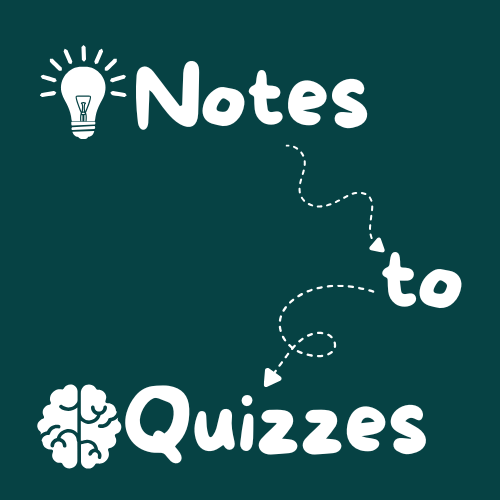

# ✏️📚 Fill-in-the-Blank Quiz Generator 🧠🎯

A simple and fun web app built with **Flask** that turns your notes into a timed fill-in-the-blank quiz! ⏳  
Challenge yourself, test your memory, and have some fun while learning! 🚀

<p align="center">
  
</p>

---

## 🌟 Features
- 📝 **Custom Notes** – Paste any text or notes to generate quiz questions.
- 🎯 **Randomized Questions** – Questions are chosen at random each time.
- ⛔ **Unaskable Words Filtering** – Common or unhelpful words are automatically skipped.
- ⏱ **Optional Timer** – Add a timer for extra challenge.
- ✅❌ **Instant Feedback** – Answers are marked right after submission.
- 🔊 **Audio Feedback** – Plays a beep sound when time runs out.

---

## 🛠️ How It Works
1. ✍️ **Input your notes** on the homepage.
2. 🔢 **Select the number of questions** you want.
3. ⏳ (Optional) **Set a timer**.
4. 🖱 **Start the quiz** – Fill in the missing words.
5. 📊 **Check your score** instantly when done.

---

## 📂 Project Structure
```
Notes-to-Quizzes/
│   app.py
│
├───static
│       beep.mp3
│       index.css
│       index.js
│       logo.png
│       quiz.css
│
└───templates
        index.html
        quiz.html
```

---

## 💡 Ideas for Improvement

- 🎨 Add themes/dark mode.
- 🌐 Make it multi-language.
- 📊 Store past scores & track progress.
- 🖼 Support image-based questions.
  
---

## 📜 License
This project is open-source and available under the MIT License.

---

## 🖋 Author
💻 Made by Kevin Ehab with ❤️ using Python & Flask
